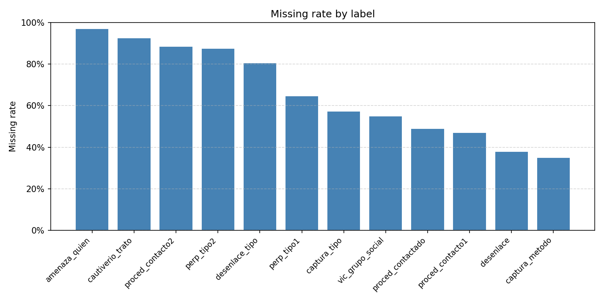
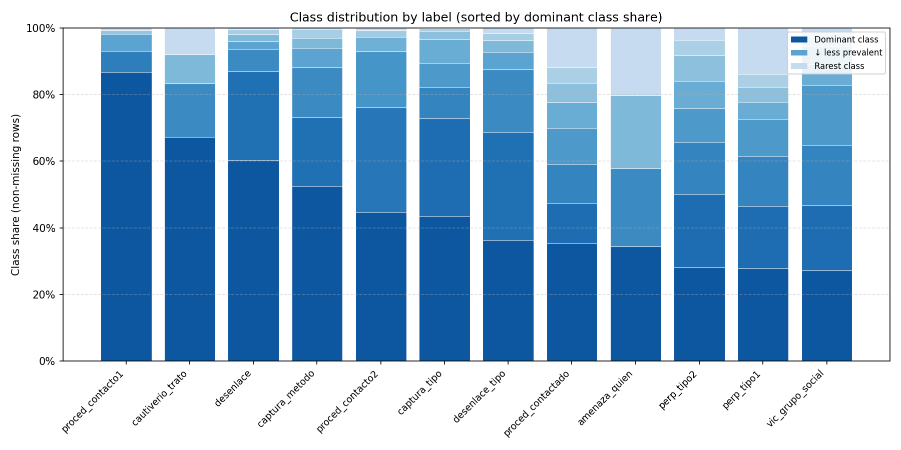

# Downstream task: fine-tuning

Models: ConfliBERT, ConflimBERT, ConflLlama

todos:
1. choose labels. Not all labels are good for fine-tuning.

issues: missing values, prevailing categories.

2. merging labels and categories (like perp_tipo1 and 2, or 10 different of crime organizations.)

issue: does is matter for end user to classify the different types of crime organizations? (needs input from Dr. Cuellar)

3. Finding edge cases

issues: after collapsing to victim level, size is not too huge(2229->575). Do we need to find edge cases to train on or just use all of them?

4. Split

issues: how do we split the data? given the limited available labels and rows?

brandt: future project: WHAT fields/labels should be created in the first place?

HOW to make them usefule, like what ELSE need to collect?
demon some what cen be done, then showcase what we need

make that a plan, then give to dr. cuellar.

this is important for the next grant.