## Acknowledgments

::: {style="font-size: 0.7em;"}

This research was supported by NSF award **OAC-2311142** and used **Delta at NCSA** through ACCESS allocation CIS220162 (NSF awards 2138259, 2138286, 2138307, 2137603, 2138296).

The corpus was originally created by the **Human Rights Program at the University of Minnesota** in partnership with the **Observatory on Disappearances and Impunity in Mexico (UNAM, FLACSO)**. We thank Barbara Frey, Maria Ignacia Terra, Yolanda Burckhardt, Maria Larson, Rosaleen Joyce, Hunter Johnson, Olga Salazar Pozos, Paula Cuellar Cuellar, and Carrie Booth Walling. Funding from Fulbright-COMEXUS, the UMN Human Rights Initiative, and the Ohanessian Endowment.

:::

# Motivation

---

## Introduction

- Researchers often inherit corpora and annotations from earlier projects.
- The annotations contains valuable expert human judgment.
- The texts and the annotations were *not* prepared for modern LLM workflows.

Can we re-use that prior coding work without recoding it?

---

## Our Dataset

- News reports corpus of disappearances in Mexico (UMN / ODIM).
- 575 victims, 2,229 news reports.
- Coded by trained human coders against codebook.

::: aside
The texts were scraped from the webpages. The codings were made at the **victim** level.
:::

---

## Why the dataset is messy for later tasks

1. **Webpage / Format Errors**: URL unreachable; page text contains navigation, menus, ads, footers.
2. **Topical distractions**: suggested articles about *other* cases, comment threads.
3. **Unit-of-analysis misalignment**: the annotations are made at the victim level.
4. **Annotations need mapping to documents**: coders may not have kept these alignments clear.

::: {.notes}

**What that misalignment costs**


- A victim's *method of capture* may live in one report, the *threats* in another: both annotated only at the victim level.
- Propagating victim-level labels to documents trains downstream models on wrong signals.


**Why not just clean and re-code?**


- Rule-based cleaning fails on per-site noise and on semantically related distractions.
- Manual re-cleaning and re-coding at this volume is slow, costly, and inconsistent.
- Many of the original sources are no longer retrievable from the webpages.
:::


# Method

## Codebook attention

A turn-by-turn pipeline that uses the **codebook as the task schema** to focus the LLM:

1. **Extract** verbatim spans for each codebook question from each document.
2. **Summarize** the document into a structured prose anchored to those spans.
3. **Update** a per-victim summary across documents while preserving prior evidence.


::: {.notes}

**What the pipeline produces**

Output is a transferable, clean, label-structured, and traceable back to source spans.

:::

## Pipeline

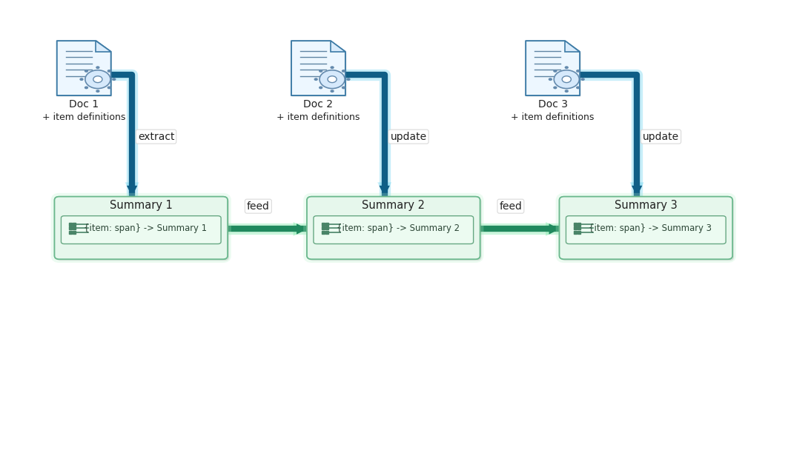{fig-align="center" width="85%"}

::: {.notes}
**Stage 1: Extraction of evidence**

- For each input document and each codebook field: return verbatim text spans.
- Each extracted span is paired with a **character offset** into the source document.
- Output is a structured evidence record keyed by label.
- Every coded field is paired with the exact source phrase that supports it.

**Stage 2: Summarization with given codebook taxonomy**

::: {style="font-size: 0.9em;"}

- Input: document text + label definitions + extracted spans.
- The summary is written **field by field**, not as free paraphrase.
- Each sentence corresponds to one codebook label, anchored to its span.
- Result: the summary is easy for a downstream classifier to consume.
:::

**Stage 3: Stateful update across turns**

::: {style="font-size: 0.85em;"}

- The pipeline keeps an explicit conversation state per victim.
- Each new document is checked against the current summary.
- Update only the fields where the new document adds information.
- If the document has no relevant content, the previous summary is preserved unchanged.
- Every turn logs: doc id, fields found, summary at that step.

:::
:::

## Example: extracted spans

::: {style="font-size: 0.5em;"}

| victim_id  | label_key  | span                                                                | offset  |
|:-----------|:-----------|:--------------------------------------------------------------------|--------:|
| Veracruz_J J R R | desenlace | "...sigue en la b&uacute;squeda, se ha convertido en detective..." | 2480 |
| Veracruz_J J R R | vic_grupo_social | "Carmelo estudiaba arquitectura en una escuela privada de dise&ntilde;o..." | 2691 |
| N.L._Fabi&aacute;n H V | desenlace | "En el expediente no hay registros del plagio ni testimonios." | 2585 |
| Veracruz_Mar&iacute;a Victoria C T | captura_tipo | "...sustra&iacute;dos de un taxi entre la calle 13 y avenida 11, frente al DIF Municipal..." | 1254 |
| N.L._Fabi&aacute;n H V | captura_tipo | "...sustrajeron al empresario del veh&iacute;culo siniestrado y se lo llevaron..." | 4109 |

The offset is the character position where the span begins in the original text, so a researcher can trace it back and verify.

:::

## Example: turn-by-turn evolution

::: {style="font-size: 0.6em;"}

Coahuila_Ezequiel C T, four documents:

| turn | info found    | labels found            | summary (excerpt)                                                                          |
|----:|:-------------:|:------------------------|:-------------------------------------------------------------------------------------------|
| 0 |: |: | (no summary produced) |
| 1 | yes | desenlace, vic_grupo_social | "Cuatro personas... fueron secuestrados por polic&iacute;as preventivos... y entregados a un c&aacute;rtel..." |
| 2 |: |: | (previous summary preserved unchanged) |
| 3 | yes | + captura_tipo | "...siete j&oacute;venes detenidos por polic&iacute;as locales y entregados a Los Zetas..." |

:::

:::{aside}
Noisy documents do not corrupt the running summary. New evidence accumulates labels.
:::


# Evaluation

## Human annotations as the gold standard

- Source-grounded LLM-as-judge methods (SummaC, G-Eval) affected by the noise.
- Reference required methods need gold standard summaries we do not have.
- The original human annotations encode the actual coding task.

# Summarization Results

## Outcome: Simple vs. Extractive

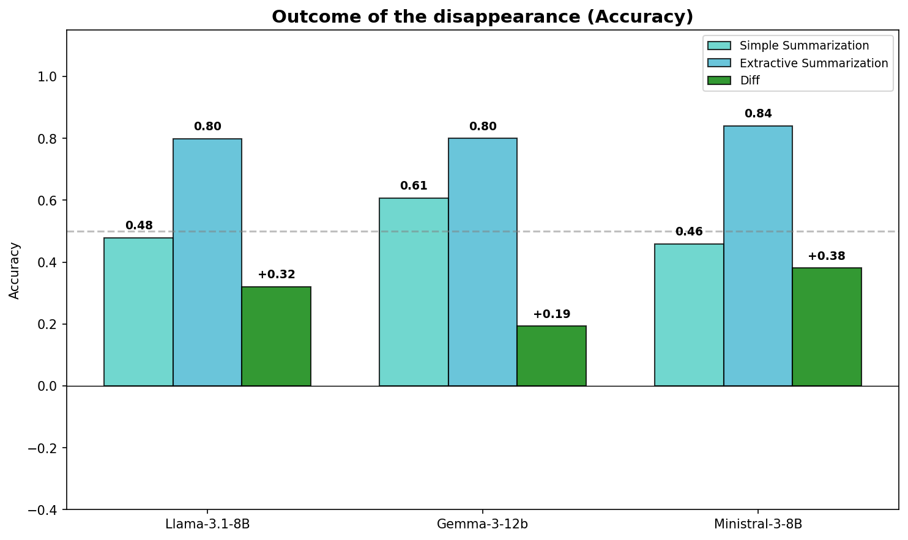{width="90%"}

## Place: Simple vs. Extractive 

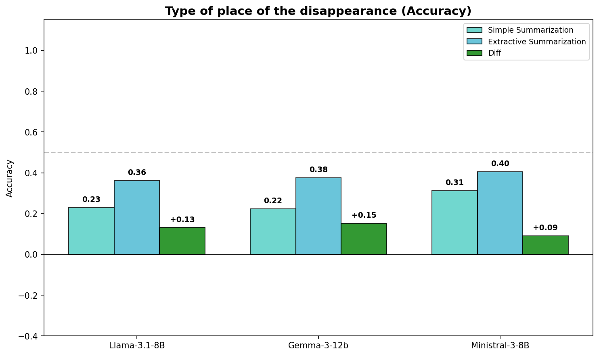{width="90%"}

## Social group: Simple vs. Extractive

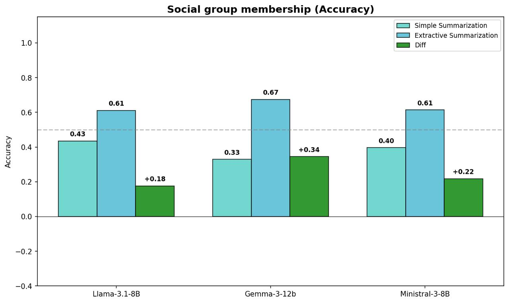{width="90%"}

<!-- ::: {style="font-size: 0.7em;"}
Teal = baseline summarization. Blue = codebook-guided extraction. Green = difference. **Every difference is positive.**
::: -->

## Cross-model comparison

::: {style="font-size: 0.8em;"}
- All models benefit from the codebook-guided extraction.
  - Ministral 8B: best on outcome (0.84) and place of capture (0.40).
  - Gemma 12B: best on social group (0.67).
- The 4B parameter gap does *not* produce a consistent advantage.
:::

The improvement comes from the workflow, not from any single model.

## Recovering annotations by turns

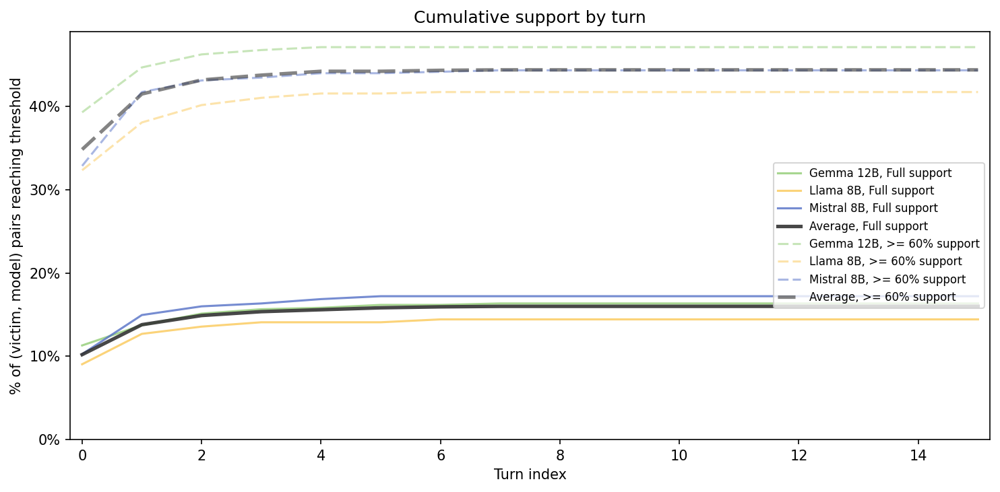{style="max-height: 48vh; width: auto; display: block; margin: 0 auto;"}

::: aside
Most of the recovery are achieved in the first 2-3 turns.
:::


## Raw text vs. Extractive summary

:::: {.columns}

::: {.column width="90%"}
::: {style="font-size: 0.9em;"}
| Label | Input | Macro F1 |
|---|---|---:|
| Outcome | Raw text | 0.656 |
|         | **Summary** | **0.723** |
| Social group | Raw text | 0.418 |
|              | **Summary** | **0.484** |
| Place of capture | Raw text | 0.600 |
|                  | Summary | 0.587 |
:::
:::

When using paraphrase-multilingual-MiniLM-L12-v2 with logistic regression classifier, the cleaned summary is favored compared to using the raw text.

::::


# Discussion

## Compute vs. human coding

::: {style="font-size: 0.9em;"}
| Model | Time | GPU |
|---|---:|---|
| Llama-3.1-8B-Instruct-AWQ-INT4 | ~34 min | A100 |
| Ministral-3-8B-Instruct-2512 | ~51 min | A100 |
| Gemma-3-12B-IT-INT4-AWQ | ~38 min | A100 |
:::

::: aside
The pipeline processes the same corpus in hours, with a full turn-level audit trail. This shifts scarce expert labor from cleanup to validation, ambiguity resolution, and substantive analysis.
:::

::: {.notes}
The Llama-8B server runs vLLM's legacy AWQ kernel (4&times; INT4 speedup only at batch size 1). Gemma's `awq_marlin` and Ministral's native FP8 path stay near peak throughput at our concurrency.
:::

## Portability to other corpora

- The codebook, label set, and prompts are configurable.
- Adapting to a new corpus requires swapping the schema, not rebuilding the pipeline.

## Thank you

See more of our work at [UTD Event Data](https://eventdata.utdallas.edu)

Xingyuan Zhao, Xingyuan.Zhao@UTDallas.edu 

---


---

# Backup slides

---

## Coverage by label availability

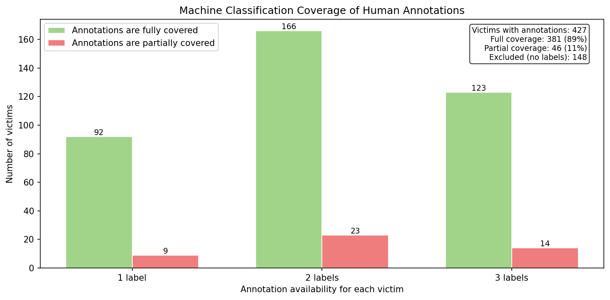{style="max-height: 48vh; width: auto; display: block; margin: 0 auto;"}

::: aside
When limited to 3 labels, the pipeline can recover most of the annotations.
:::

---

### Selected labels after merging

::: {style="font-size: 0.6em;"}

| Category | Count |
|---|---:|
| **Desenlace** (n = 393, 32% missing, 2 distinct) | |
| &nbsp;&nbsp;Still disappeared | 254 |
| &nbsp;&nbsp;Found | 139 |
| **Captura tipo** (n = 243, 58% missing, 2 distinct) | |
| &nbsp;&nbsp;Places related to the victim | 81 |
| &nbsp;&nbsp;Public and institutional spaces | 162 |
| **Vic grupo social** (n = 273, 53% missing, 5 distinct) | |
| &nbsp;&nbsp;Professionals | 145 |
| &nbsp;&nbsp;Civil servants | 61 |
| &nbsp;&nbsp;Students | 45 |
| &nbsp;&nbsp;Other | 19 |
| &nbsp;&nbsp;Organized crime | 3 |

:::

---

### Related works

::: {style="font-size: 0.8em;"}

- **Non-LLM cleaning** (rule-based, OpenRefine): handles structure, fails on per-site layouts and semantic distractors.
- **LLM data prep** (cleaning, entity matching, classification): related capability, not source-grounded for our setting.
- **Imputation** (e.g. LLM-Forest): wrong tool: we want to *preserve* what's there, not infer what isn't.
- **LLM summarization**: usually assumes clean inputs and aligned units of analysis.
- **Closest application: Ventana a la Verdad** [@Sokol_etal2025]: RAG chatbot over the Colombian Truth Commission, optimized for QA, not codebook-aligned summaries.

:::

---

### Why not LLM-as-judge?

- **SummaC** scores source &harr; summary consistency via NLI. Rewards keeping noise.
- **G-Eval** uses an LLM judge with structured rubrics. Same exposure to source-side noise.
- Either method may *penalize* a clean, focused summary for omitting distractive content.
- Our annotations are the only reliable anchor.

---

### Hallucination evaluation, briefly

- Most relevant risk: **input-conflicting hallucination** (output not supported by source).
- Standard methods (FActScore, SummaC, G-Eval) assume clean sources or external evidence retrieval.
- The pipeline's design itself constrains hallucination: extraction step pins each label to a verbatim span with offset.

---

### Three sources of error

::: {style="font-size: 0.85em;"}

1. **Document-level noise**: error pages, navigation, distractive content. Codebook-guided extraction filters most of this at extraction time.
2. **Lost documents**: some sources the human coders consulted are no longer retrievable. The pipeline records and quantifies this rather than hiding it.
3. **Label ambiguity**: some texts defensibly support more than one category. Counted as a classification error, but not a pipeline failure.

Knowing which is which is itself a contribution to transparency.

:::

---

### Sample messy reports

(1) HTTP error page

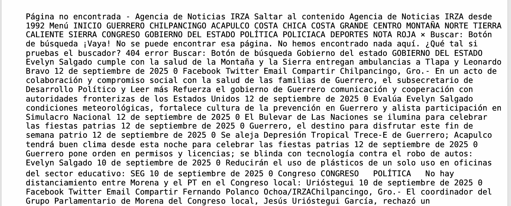{width="60%" fig-align="center"}

---

(2) Website components mixed with body text

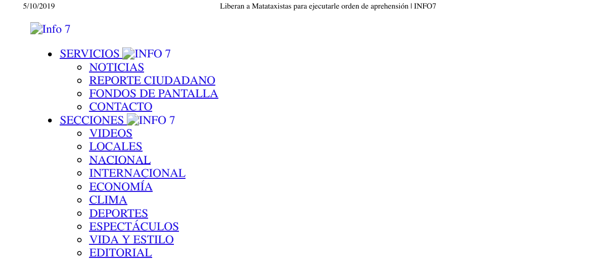{width="60%" fig-align="center"}

---

(3) Topically adjacent but unrelated content

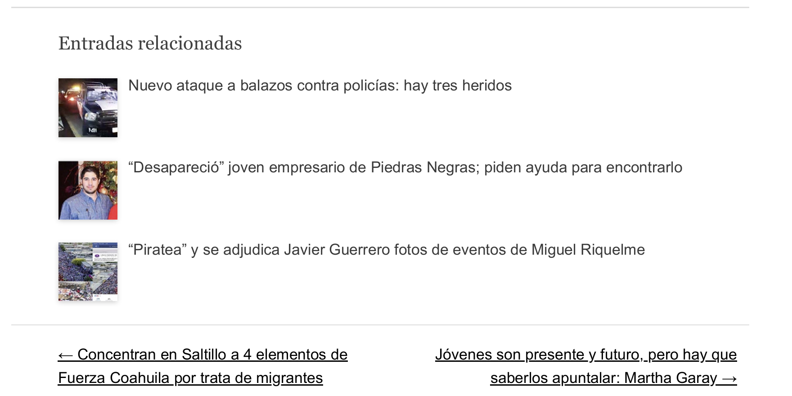{width="60%" fig-align="center"}

---

### Press-based corpus

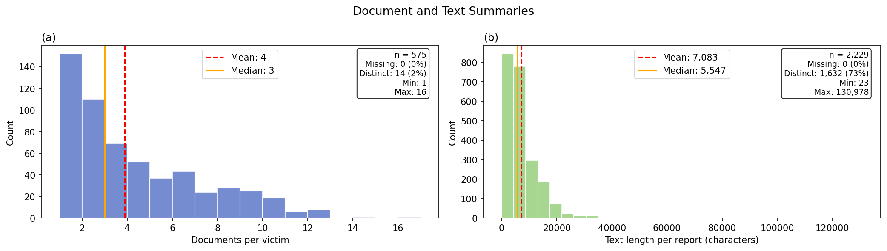{fig-align="center" width="65%"}

::: {style="font-size: 0.8em;"}
575 victims, 2,229 reports. Median 3 reports per victim. Median report length ~5,500 characters; long tail to >130k.
:::

---

### Three selected labels

Picking relevant and low missing rate labels:

- **Desenlace**: outcome of the disappearance (n = 393)
- **Captura tipo**: type of place of capture (n = 243)
- **Vic grupo social**: social group of the victim (n = 273)

::: aside
Fine-grained categories were collapsed into broader groups before evaluation to reduce penalty from defensible disagreement.
:::

---

### Ethics

- Victim names are masked while preserving dates, locations, and violation types.
- Cases involve ongoing risk to families from criminal organizations and state actors.
- Anonymization follows standard human rights documentation practice.
- Analytical value (patterns, language, framing) is preserved; identifying detail is not.

---


## Stage 1: Extraction of evidence

- For each input document and each codebook field: return verbatim text spans.
- Each extracted span is paired with a **character offset** into the source document.
- Output is a structured evidence record keyed by label.
- Every coded field is paired with the exact source phrase that supports it.

---

## Stage 2: Summarization with given codebook taxonomy

::: {style="font-size: 0.9em;"}

- Input: document text + label definitions + extracted spans.
- The summary is written **field by field**, not as free paraphrase.
- Each sentence corresponds to one codebook label, anchored to its span.
- Result: the summary is easy for a downstream classifier to consume.

:::

---

## Stage 3: Stateful update across turns

::: {style="font-size: 0.85em;"}

- The pipeline keeps an explicit conversation state per victim.
- Each new document is checked against the current summary.
- Update only the fields where the new document adds information.
- If the document has no relevant content, the previous summary is preserved unchanged.
- Every turn logs: doc id, fields found, summary at that step.

:::


---

### Pipeline I/O schema (for reference)

::: {style="font-size: 0.7em;"}

```json
{
  "previous_summary": "<text>",
  "input_text": "<document text>",
  "label_definitions": {
    "captura_tipo": "Where was the victim taken from?",
    "desenlace": "What was the outcome of the disappearance?"
  }
}
```

```json
{
  "spans_by_item": {
    "captura_tipo": "...sustra\u00eddos de un taxi entre la calle 13...",
    "desenlace": "..."
  },
  "summary": "<label-structured text>"
}
```

:::

---

### Recovering annotations by turns

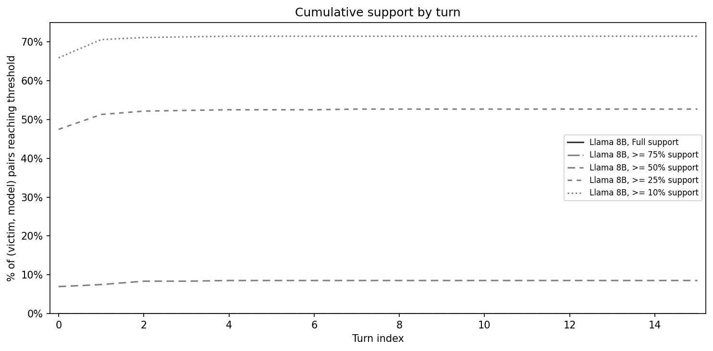{style="max-height: 48vh; width: auto; display: block; margin: 0 auto;"}

::: aside
Most victim can recover several labels after 2-3 turns; but more labels recovery is rare.
:::

---

### Coverage by label availability

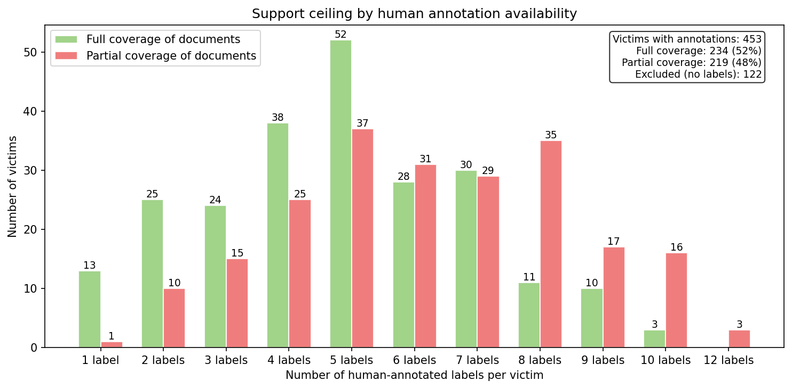{style="max-height: 48vh; width: auto; display: block; margin: 0 auto;"}

::: aside
For victims with less annotations, it is easier to recover all of them.
:::
