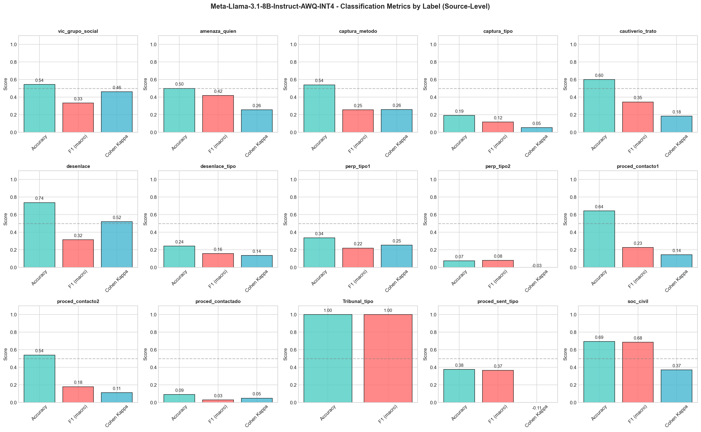
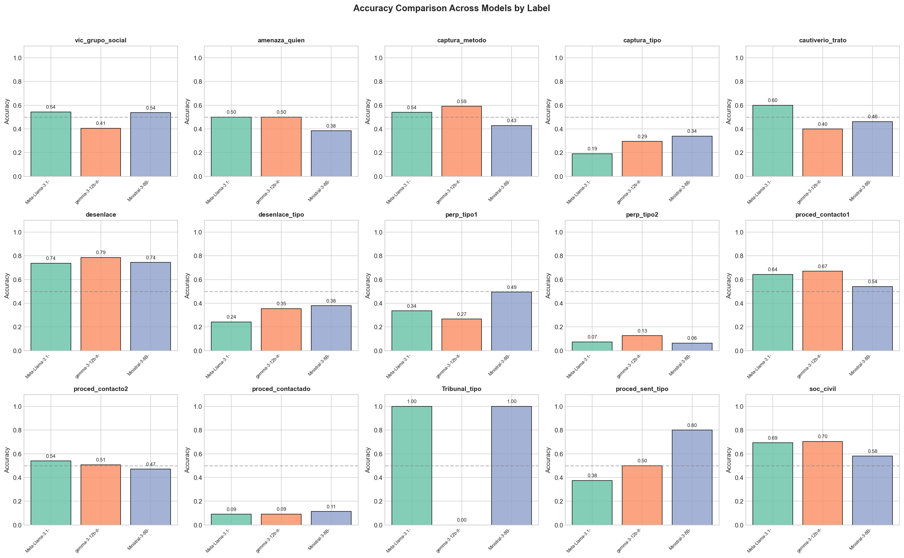
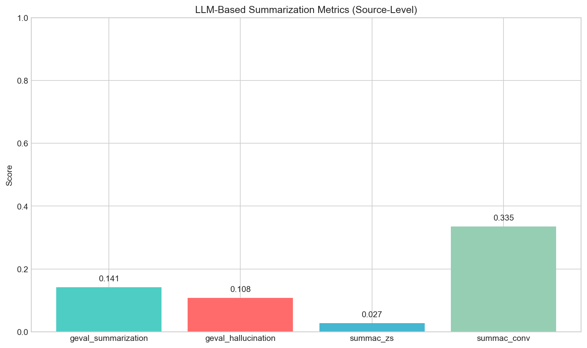
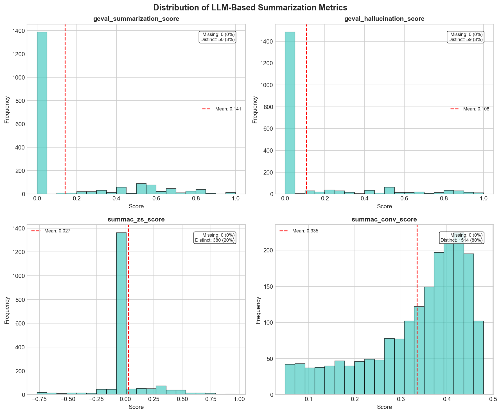

## Stage 1: Summarization

**Input**: Raw messy text (aggregated to victim level) with navigation, ads, error pages etc.

```json
{
  "input_text": "Menu | Home... Abel soñaba ser ingeniero...",
  "related_context": {"vic_grupo_social": "Is the victim...", ...},
  "output_format": {"info_found": "", "relevant_context": [], "summary": ""},
  "instructions": ["Extractive in Spanish, DO NOT paraphrase", 
    "If error page (404), return empty", "Ignore navigation", ...]
}
```

**Output**:

```json
{
  "info_found": "TRUE",
  "relevant_context": ["vic_grupo_social", "captura_metodo"],
  "summary": "Abel soñaba ser ingeniero. Fue detenido por policías."
}
```

---

## Stage 2: Classification

**Input**: Clean summary + taxonomy question

```json
{
  "input_text": "Abel soñaba ser ingeniero... detenido por policías",
  "question": "Is the victim a member of a distinct social group?",
  "possible_values": ["Students", "Professionals", "Activists", ...],
  "instructions": ["Return evidence AND result", "result MUST be one of possible_values", ...]
}
```

**Output**:

```json
{
  "evidence": "estudiante de la preparatoria",
  "result": "Students"
}
```

---

## Classification Metrics (Source-Level)

Accuracy, Macro F1, and Cohen's Kappa for each classification label, using Llama 3.1 8B instruct.

{width="90%"}

---

## Classification Metrics (Victim-Level)

Accuracy comparison across models for each classification label

{width="90%"}

---

## LLM-Based Summarization Metrics

COMET, BLEU, ROUGE require reference summaries. We have none.

Used **reference-free** metrics instead:

- **[G-Eval](https://arxiv.org/abs/2303.16634)**: Prompt-based evaluator. Inputs source and summary, and tasks in stacked promtps to output scores.

- **[SummaC](https://arxiv.org/abs/2111.09525)**: Segments source and summary into sentences, use pretrained NLI models to compute scores.

---

## LLM Metrics: Aggregated Scores

{width="70%"}

---

## LLM Metrics: Score Distributions

{width="80%"}

---

## Next Steps

- Stacking prompts
- Input documents in multiple turns

- collapsing categories
- unit of analysis
- AEC, Upsala 
- Extractive AND Summarization, restructre the OUTPUT PROMPT, thinking about COMPONENT, with PURPOSE.
- when stacking, thinking about doc quality or coherence / complexity