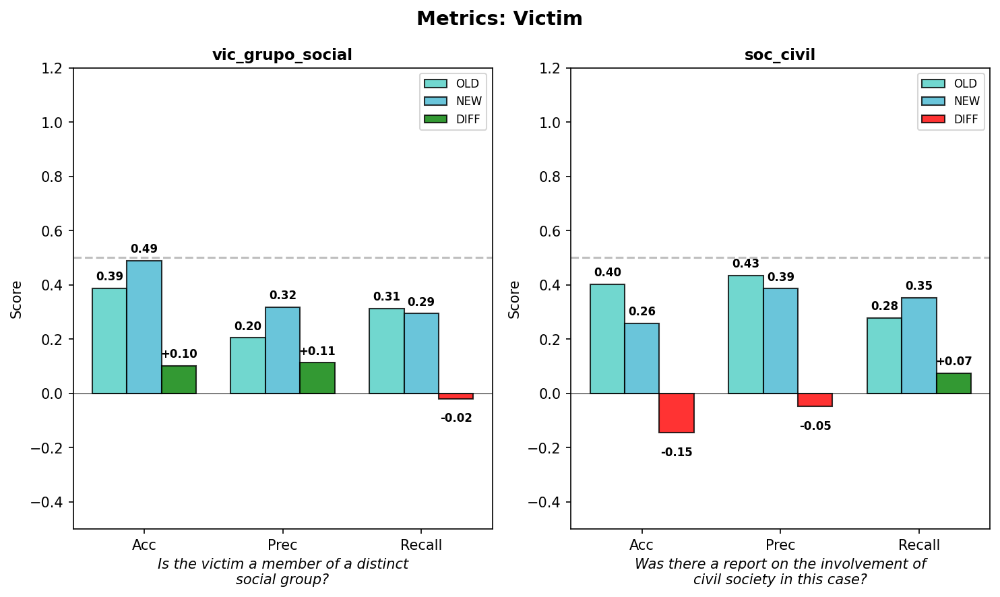
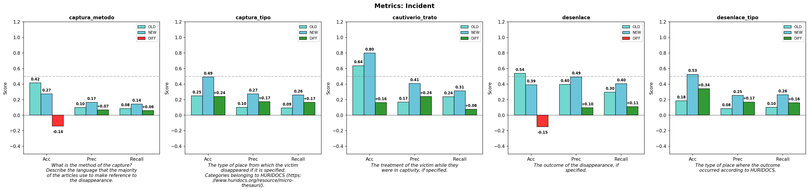
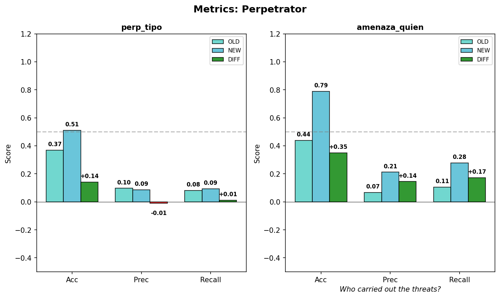
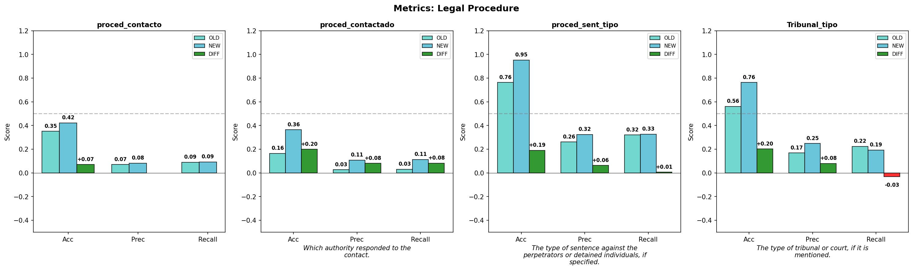

th---
title: "Extractive Summarization of Messy Text"
format: revealjs
---

## Motivation

Researchers may want to code _new data or source materials_ based on a *prior set of messy example cases* (and possibly a codebook). 

---

## Motivation

However, we may encounter some issues:
1. Training the new coders comes at a cost
2. LLMs and AI are now here to help
3. Documents were initially organized by origin or source and not task
   or unit of analysis.

---

## Task Definition

*Main task:* How do we reuse the *old* codebook or the *old* work / examples / annotations from the human coders to inform the new coding task?

---

*Complications:* 

1. Training costs and lost knowledge
2. badly recorded earlier annotations (so coders coded features rather
   than spans)
3. Coders translated from language 1 and coded a dataset in language
   2?
4. Coders used multiple documents across multiple languages to make
   the dataset.
5. The original corpora used in the above were not cleaned for modern
   LLM inputting, so there as implicit document cleaning and
   organization before coding / annotation. 

---

### Sample of the Messy Text

(1) Error pages


---

(2) Website formats, such as navigation menus.


---

(3) Distractive information that are somewhat related but should not be there, such as suggested articles or comments from other users.


---

## What is the UA and how is is related to the texts?

Unit of analysis (UA) for what we have here is the kidnapping victim
from the UMN-ODIM datasets. For each one we need to go back to the
source texts and 

- Align annotations with the original texts
- Allows re-use the annotations and coded data via connection to the
  source texts

The final goal is to eventually use this to train an LLM to forecast
and classify future texts or future classification and coding new
documents or reports of possible kidnappings.

---

## Methods being used and compared

What are we comparing / answering?

How do we construct the summaries (not pure "cat file1 file2") 


## Unit of Analysis Problem

The UA in UMN dataset: victim

The final goal is to eventually use this to train an LLM to forecast
and classify future texts or future classification and coding new
documents or reports of possible kidnappings.

So the required UA for the downstream task: reports


<!---it means that we have annotations for each victim, such as victim's social group, method of capture, etc, but for downstream task, we need to go back to the source texts and align the annotations with the original texts--->

---

## Unit of Analysis Problem

Things we need to do:
- Align annotations with the original texts
- Allows re-use the annotations and coded data via connection to the
  source texts


---

**output_format** (from prompts.json):

```json
{
  "summary_by_item": {"vic_grupo_social": "...", "captura_metodo": "..."},
  "summary": "<text in spanish>"
}
```

---

Guerrero_Adolfo V de la P Example:

The three missing officials are members of the Guerrero state government. The armed group intercepted the victims and took them by force. The disappearance occurred in the municipal seat of Arcelia. The armed group that carried out the abduction belongs to a criminal organization. The families of the missing individuals filed complaints with the authorities. It is not specified which authority responded to the complaint. No specific court or tribunal is mentioned....

---

# Method

## Model Setup

- Llama 3.1 8B Instruct (AWQ INT4)
- Llama 3.1 70B Instruct (AWQ INT4)
- Gemma 3 12B IT (INT4 AWQ)
- Gemma 3 27B IT (INT4 AWQ) (todo)
- Ministral 3 8B Instruct
- Mistral 24B Instruct (todo)

---


## Extraction vs Summarization

- Summarization: condenses text, may paraphrase
- Extraction: copies exact spans from source text
- Simple summarization loses traceability to source
- Our task requires both: summarize by item, using extracted spans as evidence

---

## Pipeline

::: {style="background-color: white; padding: 10px; border-radius: 8px; --mermaid-label-bg-color: white; --mermaid-edge-color: #333;"}
```{mermaid}
%%{init: {'theme': 'default'}}%%
flowchart TD
    D1[/"Doc 1 + item definitions"/] -->|extract| S1[["#123;item: span#125; → summary_1"]]
    S1 -->|feed| S2
    D2[/"Doc 2 + item definitions"/] -->|update| S2[["#123;item: span#125; → summary_2"]]
    S2 -->|feed| S3
    D3[/"Doc 3 + item definitions"/] -->|update| S3[["#123;item: span#125; → summary_3"]]
```
:::

---


## Pipeline

- For each victim, process their documents one at a time
- Each turn sends the LLM: input text + label definitions (what to look for) + previous summary (if exists)

---

- First turn: extract spans from document by label item
- Subsequent turns: 
  - Existing label, new info found -> add new spans, keep old spans
  - Existing label, no new info -> keep previous unchanged
  - New label found -> extract spans from current document
- Output per turn: `summary_by_item` (exact spans per label) + combined `summary`

---

### Example Results

**spans.csv** — extracted evidence per field

| victim_id | label_key | span | offset |
|-----------|-----------|------|--------|
| Coahuila_Abel M H | vic_grupo_social | "Most of the disappeared were taxi drivers..." | -1 |
| Coahuila_Abel M H | proced_contacto1 | "Relatives of the disappeared" | 2249 |

---

**results.csv** — summary by turn

| victim_id | turn | summary |
|-----------|------|----------------|
| Coahuila_Aurora Zuzeth T P | 0 | — |
| Coahuila_Aurora Zuzeth T P | 1 | "Someone took them from two addresses" 

---

# Evaluation

## Human Gold Standard

- Classification based off the summary text
- Human annotations are used as the gold standard for comparison
- Compared the results from the baseline simple summarization and the proposed method

---

## Baseline vs Proposed Method



---

## {.center}



---

## {.center}



---

## {.center}



---

# Conclusion and Future Work

- Drafting the paper

- Some labels are decreased in accuracy for some reason, need to investigate why

- Find other ways to evaluate the hallucinations
