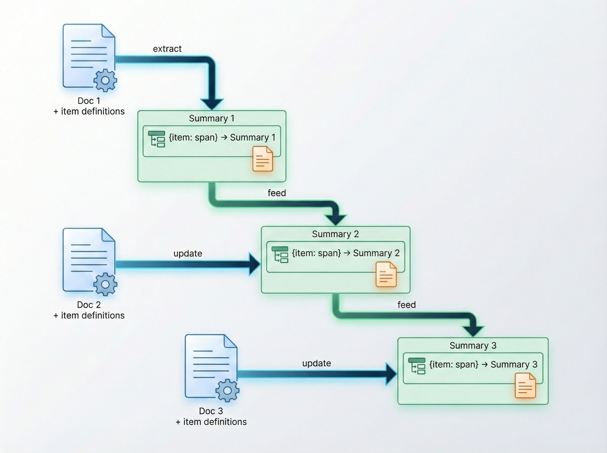
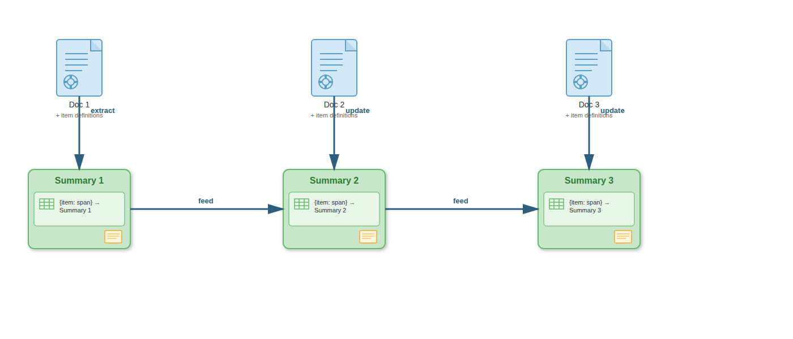

## Motivation

### Original Task

Code new data or source materials based on a prior set of example cases (and possibly a codebook).

### Data

Disappearances reports in Mexico collected and annotated by UMN.

---

### Complications
1. Training the new coders comes at a cost
2. LLMs are now here to help
3. Documents were initially organized by origin or source and not task or unit of analysis.

---

### Main Task

How do we reuse the *old* codebook / work / examples / annotations from the human coders to inform the new coding task?

---

### Complications
1. Training costs and lost knowledge
2. Unit of analysis problem: the existing works are coded by features of victims, rather than spans or documents.
3. Coders used multiple documents across multiple languages to annotate and make the dataset.
4. The original corpora used in the above were not cleaned for modern LLM inputting

---

### Sample of the Messy Text

(1) Error pages


---

(2) Website formats, such as navigation menus.


---

(3) Distractive information that are somewhat related but should not be there, such as suggested articles or comments from other users.


---

### Unit of Analysis Problem

Downstream tasks:

- Utilize the documents and annotations to train an LLM
- Code new documents or reports of possible kidnappings.
- Forecast and classify future texts or future classification

So the required UA for the downstream task: documents

---

### Things we need to do:

- Align annotations with the original texts
- Allows re-use the annotations and coded data via connection to the source texts
- Generate noise-free summaries of the documents

---

### What needs to be cleaned and summarized?

  - Regather the candidate reports. 
  - Clear out the extraneous information (HTML tags, comments, advertising)
  - Summarize these reports into a common representation or format
  - Propose features based on the summaries that may match those provided before by the human annotators based on the definitions in the codebook

---

### Generative AI vs Extractive AI

- Generation Task: condenses text, may paraphrase
- Extraction Task: copies exact spans from source text
- Simple generative summarization loses traceability to source
- Our task requires both extraction and generation

---

### General case vs specific case

::: {style="font-size: 0.65em;"}
| Local Issue | General version | Specifics |
|----|----|----|
| Data collected by news source do not match UA | Access data by coverage then extract events or UA | UA alignment using llm |
| Annotations by UA do not match downstream task | Features are to be annotated by experts across multiple docs | UA alignment using llm |
| Multiple reports aggregated to get data fields | Document de-duplication and info extraction | Extractive AI |
| Users carried out multiple simultaneous tasks to code | Multiple tasks and tools can be applied | Using multi turns stateful workflows |
:::

---

## Method


### Model Setup

- Llama 3.1 8B Instruct (AWQ INT4)
- Llama 3.1 70B Instruct (AWQ INT4)
- Gemma 3 12B IT (INT4 AWQ)
- Gemma 3 27B IT (INT4 AWQ) (todo)
- Ministral 3 8B Instruct
- Mistral 24B Instruct (todo)

---

### What are we comparing / answering?

- Generative only vs Extractive Summarization
- Performance across models
- Performance between larger and smaller models


---

### Pipeline

- For each victim, process their documents one at a time
- Each turn sends the LLM: 
  - input text
  - label definitions (what to look for)
  - previous summary (if exists)

---

Input:

```json
{
  "previous_summary": "<text in spanish>",
  "input_text": "<text in spanish>",
  "label_definitions": ["amenaza_quien": "Who carried out the threats?", ...],
  "instructions": ["For each key X in existing previous_summary_by_item, check if there is any new information about X in input_text. If yes, update summary_by_item[X]."]
}
```

Output:

```json
{
  "spans_by_item": {"amenaza_quien": "...", "captura_metodo": "..."},
  "summary": "<text in spanish>"
}
```
---

### Pipeline


<!--  -->


---

### Example Results

**spans.csv** — extracted evidence per field

::: {style="font-size: 0.80em;"}
| victim_id | label_key | span | span_index |
|-----------|-----------|------|--------|
| Veracruz_A Y P B | captura_metodo | "...an armed group took them away..." | 5258 |
| Veracruz_J G G | captura_metodo | "...people were picked up by police..." | 4420 |
| Coahuila_A M H | proced_contacto1 | "Relatives of the disappeared" | 2249 |
:::

---

**results.csv** — summary by turn

| victim_id | turn | summary |
|-----------|------|----------------|
| Coahuila_A J P S" | 0 | "...the person reported missing was located..." |
| Coahuila_A J P S | 3 | "...a student at UANE, was seen by..." |
| Coahuila_A J P S | 4 | "...The Deputy Attorney General's Office reported that..." |


---

## Evaluation

### Human Gold Standard

- Classification based off the summary text
- Human annotations are used as the gold standard for comparison
- Compared the results from the baseline simple summarization and the proposed method

---

### Baseline vs Proposed Method

*plots need some rework*


---

### {.center}


---

### {.center}


---

### {.center}


---

## Conclusion and Future Work

- Descriptive statistics of the data
- Evaluations across models
- Drafting the paper

---

## Acknowledgments

This research was funded by NSF.