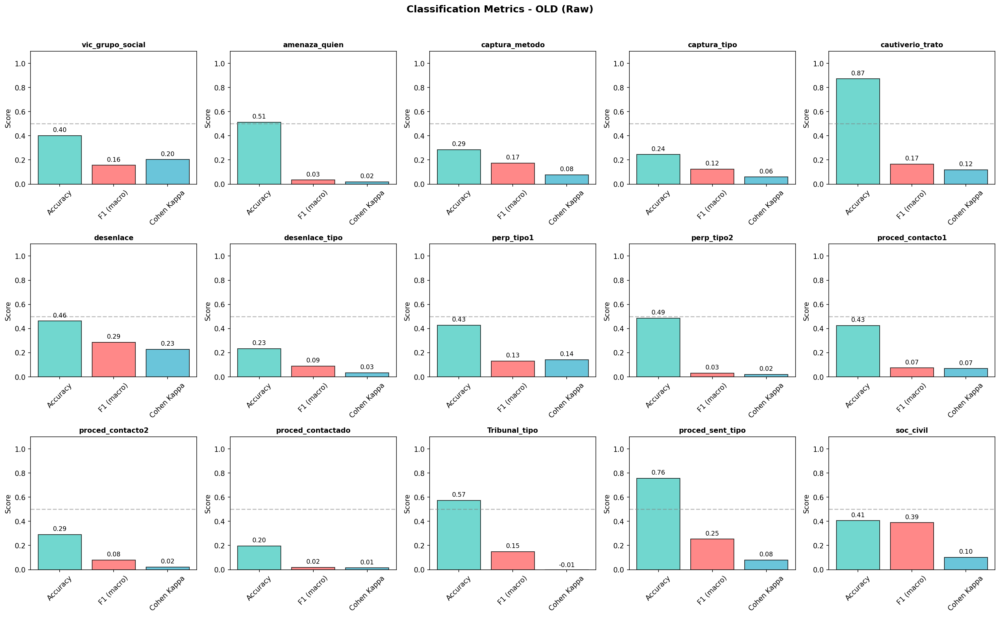
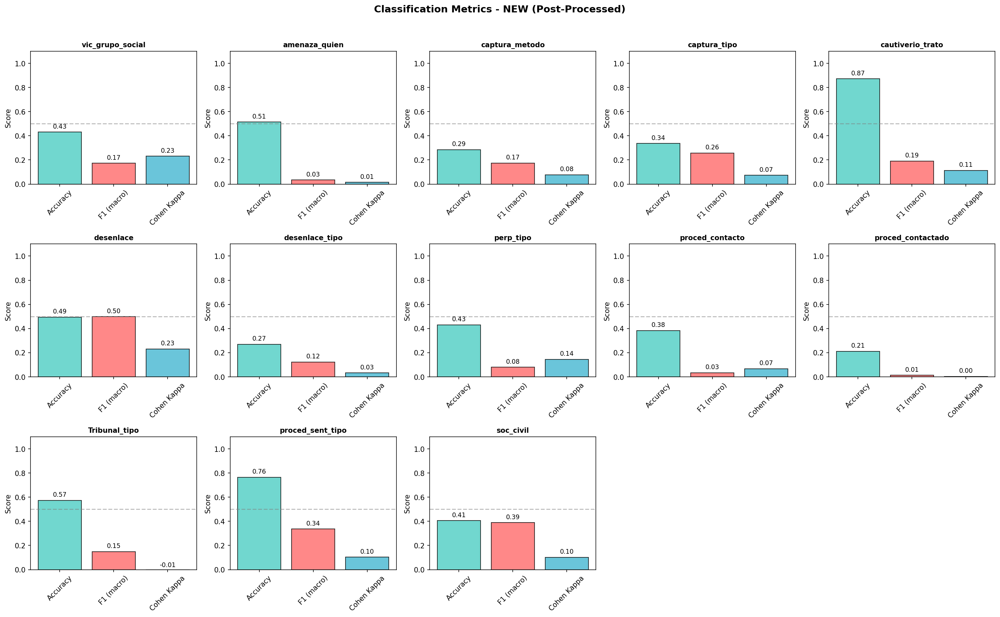
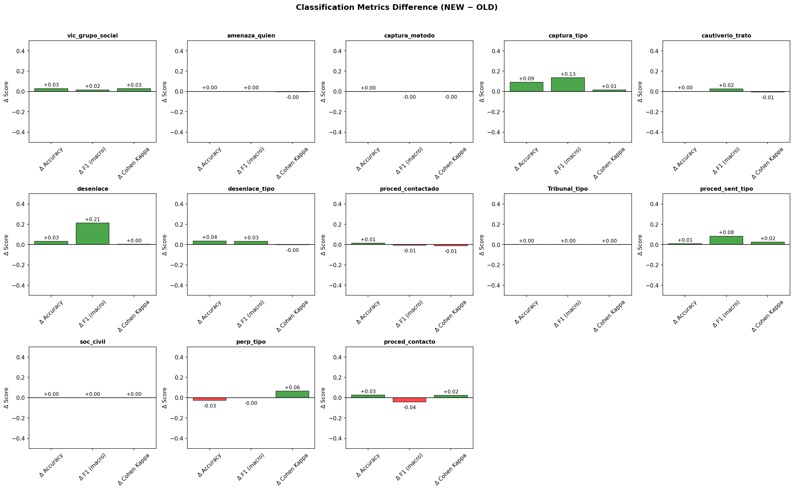

## 1. Stacking Prompts: Conversation Mode

**Problem**: Single document → Distracted info

**Solution**: Send documents one by one, update summary incrementally

```
Doc 1 → summary_first → summary_1
Doc 2 + summary_1 → summary_update → summary_2
Doc 3 + summary_2 → summary_update → summary_3
...
```

---

## Prompt: summary_update (verbatim)

```json
{
  "instructions": [
    "If the previous summary above is non-empty, update it by 
     adding or refining victim-relevant facts from input_text, 
     without removing correct existing details.",
    "For each key X in existing previous_summary_by_item, check 
     if there is any new information about X in input_text. 
     If yes, update summary_by_item[X]."
  ]
}
```

---

## 2. Extractive Summarization

**output_format** (from prompts.json):

```json
{
  "summary_by_item": {"vic_grupo_social": "...", "captura_metodo": "..."},
  "summary": "<texto in spanish>"
}
```

---

## 3. Collapse Categories

### 3.1 Monophyletic Problems

1. **HIERARCHICAL**: Parent category exists alongside its children. LLM may pick child, human may pick parent. Example: "State agent" vs "Municipal police"

2. **OVERLAPPING**: Multiple labels describe same concept. Example: "Kidnapping" vs "Plagio" vs "Levantón"

3. **NON-EXCLUSIVE**: A single entity can belong to multiple categories. Example: Mayor is both "Civil servant" AND "People associated with politics"

---

### 3.2 Catch-all Categories

NO CATCHALL: Positive criteria only, no residual categories as complement set of others

- "Other", "No information" absorb ambiguous cases

---

### 3.3 Parenthetical Suffixes

Human annotates: `"Municipal police (they depend on the PGR...)"`

LLM treats `()` as supplementary → outputs: `"Municipal police"`

**Result**: String mismatch → false negative

---

## Example: captura_tipo

> "The victim was an 8-year-old girl who was approached by an adult male while playing outside a **bus route office** in a **residential area** in Ciudad Juárez."

- **LLM**: Economic, social, industrial... (bus office = service center)
- **Human**: Places related to the victim (residential area)

**Both valid** → false negative in evaluation

---

## Solution: 4-Stage Pipeline

| Stage | Action |
|-------|--------|
| 1 | Normalize: NaN→"", strip parentheses |
| 2 | Merge: tipo1+tipo2 → tipo (list) |
| 3 | Coarsen: Municipal police → State-affiliated |
| 4 | Recalculate _match columns |

---

## Results

{width=90%}

---

## Results (Post-Processed)

{width=90%}

---

## Results (Difference)

{width=90%}

---

## Conclusion

**Improved**: vic_grupo_social, captura_tipo, desenlace, desenlace_tipo

**Not fully resolved**: perp_tipo, proced_contacto (merged labels)

- List comparison introduces complexity
