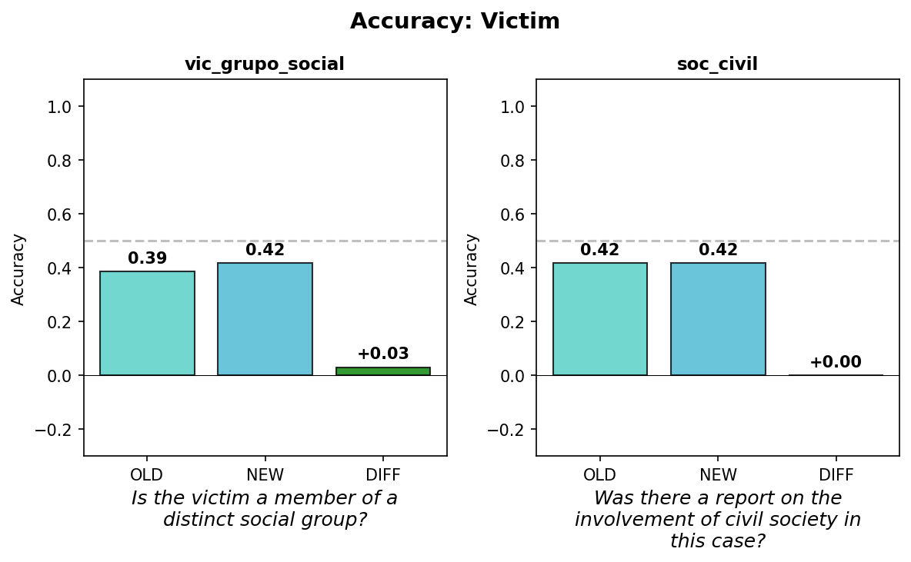
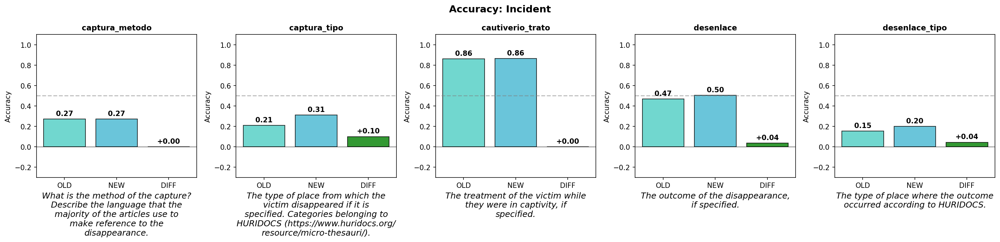
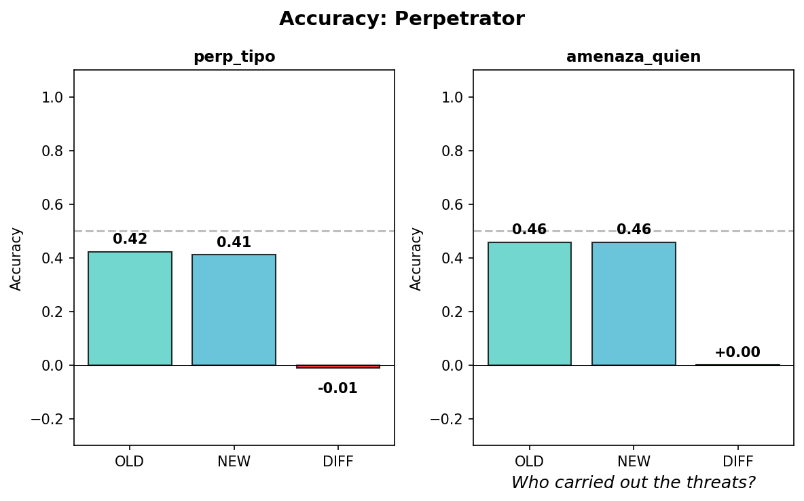
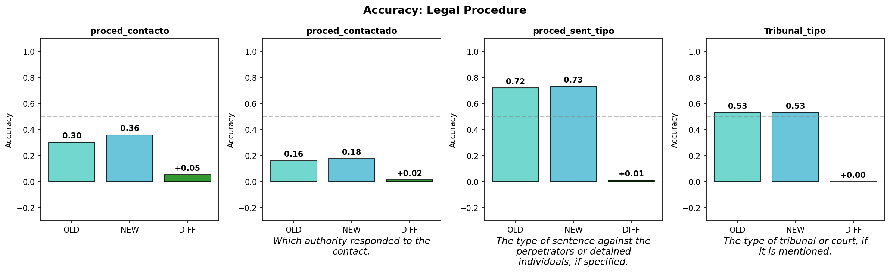

## 1. Multi-turn Summarization

**Problem**: Single document → Distractive info

**Solution**: Send documents one by one, update summary incrementally

```
Doc 1 → first_summary → summary_1
Doc 2 + summary_1 → summary_update → summary_2
Doc 3 + summary_2 → summary_update → summary_3
...
```

---

## Prompt: Summary by Item Update

```json
{
  "instructions": [
    ...
    "If the previous summary above is non-empty, update it by 
     adding or refining victim-relevant facts from input_text, 
     without removing correct existing details.",
    "For each key X in existing previous_summary_by_item, check 
     if there is any new information about X in input_text. 
     If yes, update summary_by_item[X]."
     ...
  ]
}
```

---

## 2. Extractive Summarization

**output_format** (from prompts.json):

```json
{
  "summary_by_item": {"vic_grupo_social": "...", "captura_metodo": "..."},
  "summary": "<text in spanish>"
}
```

---

Guerrero_Adolfo V de la P Example:

The three missing officials are members of the Guerrero state government. The armed group intercepted the victims and took them by force. The disappearance occurred in the municipal seat of Arcelia. The armed group that carried out the abduction belongs to a criminal organization. The families of the missing individuals filed complaints with the authorities. It is not specified which authority responded to the complaint. No specific court or tribunal is mentioned....

---

**spans.csv** — extracted evidence per field

| victim_id | label_key | span | offset |
|-----------|-----------|------|--------|
| Coahuila_Abel M H | vic_grupo_social | "Most of the disappeared were taxi drivers..." | -1 |
| Coahuila_Abel M H | proced_contacto1 | "Relatives of the disappeared" | 2249 |

---

**results.csv** — summary by turn

| victim_id | turn | summary |
|-----------|------|----------------|
| Coahuila_Aurora Zuzeth T P | 0 | — |
| Coahuila_Aurora Zuzeth T P | 1 | "Someone took them from two addresses" 

---

## 3. Merging Labels

- Overlapping labels (Kidnapping / Plagio / Levantón)
- Separated labels (perp_tipo1 + perp_tipo2)
- Parenthetical notes stripped (Particulars (when you cannot identify their affiliation to an organized criminal group))

→ Post-processing before evaluation

---

## Example: captura_tipo

**Example**: "The victim was an 8-year-old girl who was approached by an adult male while playing outside a **bus route office** in a **residential area** in Ciudad Juárez."

- **LLM**: Economic, social, industrial... (bus office = service center)
- **Human**: Places related to the victim (residential area)

---

## Results

{.r-stretch}

## {.center}

{.r-stretch}

## {.center}

{.r-stretch}

## {.center}

{.r-stretch}


---

## Conclusion

**Improved**: vic_grupo_social, captura_tipo, desenlace, desenlace_tipo

**Not fully resolved**: perp_tipo, proced_contacto (merged labels)
